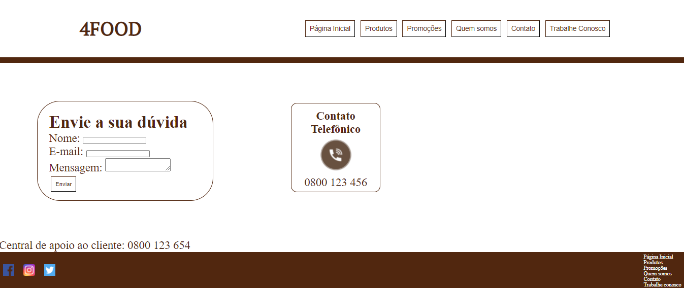

# landing-page-template

## Link do Site
standing-surprise.surge.sh

## Descrição
Landing page da empresa 4FOOD.

O 4Food é uma rede de supermercados que buscou criar e facilitar um sistema de compras e entregas recorrentes por aplicativo. O site conta com as seções:

### Página Inicial
Página inicial do Site, podendo clicar em botões e ir para as categorias da seção de produtos.

### Produtos
Seção de produtos com várias categorias como Hortifruti, Limpeza, Higiene, etc.

### Promoções
Seção de produtos em promoção.

### Quem Somos
Seção que conta um pouco sobre a empresa.

### Contato
Seção para entrar em contato com a empresa.

### Trabalhe Conosco
Seção para enviar seu currículo para trabalhar com a empresa.

## O que funciona
Os botões todos funcionam e as páginas também.

## O que não funciona
Nas páginas contém uma sobra na largura a qual não deu para encontrar a solução.
Não tem responsividade para celulares, apenas parte da página inicial.
